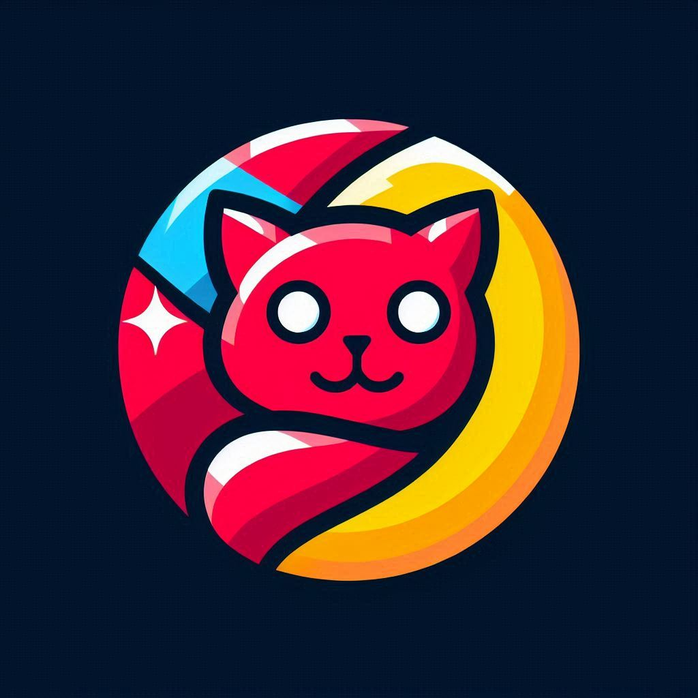

# [Kantalo](https://kantalo.kesug.com)
> A language entirely made in node.js, with the aim of making life easier for developers.


---

# How to use? 🤔

1. Install [node.js](https://nodejs.org/) on your system along with [git](https://git-scm.com/downloads)
2. Type `git clone https://github.com/skaylatk/kantalo`
3. Then go to the "kantalo" folder in the directory where you used git clone
4. Use `cd bin`
5. Create a file, it can be any name Example: `<main.klo>`
6. To run your code type `node klo.js <main.klo>`

---

# Documentation

## declare variables

To declare a variable in the language we use `var.save`
Example:

```js
var.save date = "12/16/2024"
```

[WARNING] var.save only accepts text strings, not integers.


## Using messages in the console
to send text to the console, we use `terminal.text`

Example:
```js
terminal.text("Hello world")

## for variable calls we use -**-
// Ex:
var.save name = "Maria"
terminal.text("Hello -*name*-")
```

---
# Update Fixes

> *V0.0.1-beta.2* -  _Bugs in the code, and the correction of var.create_

---
# Links

- [Documentation](https://kantalo.kesug.com/?i=1)
- [Vscode extension](https://marketplace.visualstudio.com/items?itemName=Skaylatk.kantalo)
